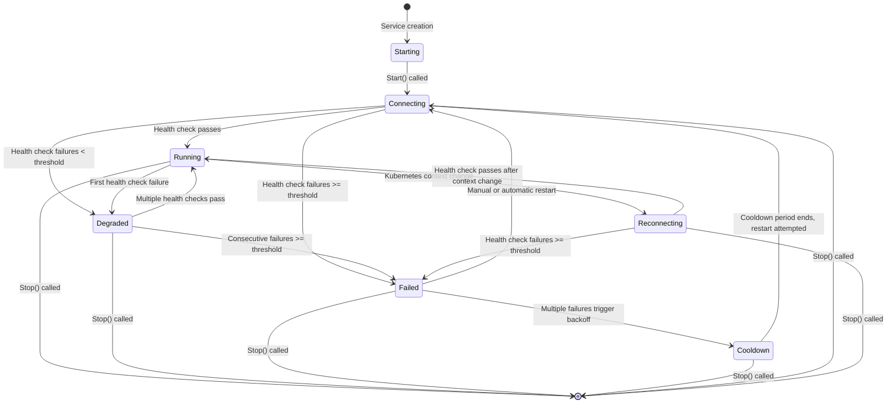

# kportforward Service State Diagram

This document illustrates the possible state transitions for services in kportforward. The diagram shows how services move between different states based on events like startup, health checks, context changes, and failures.

## State Diagram

## State Descriptions

| State | Description | Visual Indicator | Transition Triggers |
|-------|-------------|------------------|---------------------|
| **Starting** | Initial state when service is created | Orange dot | Transitions to Connecting when Start() is called |
| **Connecting** | Service is starting the port-forward | Blue dot | Transitions to Running when health checks pass, or to Degraded/Failed if health checks fail |
| **Running** | Service is healthy and operational | Green dot | Transitions to Degraded on first health check failure, or to Reconnecting on context change |
| **Degraded** | Service has health check issues but not enough to fail | Orange dot | Transitions to Running when health checks pass again, or to Failed if consecutive failures reach threshold |
| **Reconnecting** | Service is restarting due to context change | Blue dot | Transitions to Running when health checks pass after reconnection |
| **Failed** | Service has failed health checks or other issues | Red dot | Transitions to Cooldown if multiple failures occur, or to Connecting on restart |
| **Cooldown** | Service is waiting before retry due to backoff | Gray dot | Transitions to Connecting when cooldown period ends |

## Transition Details

### Healthy Path
- **Starting → Connecting → Running**: Normal startup sequence when everything works
- **Degraded → Running**: Recovery after transient issues
- **Reconnecting → Running**: Successful reconnection after context change

### Problem Paths
- **Running → Degraded → Failed**: Progressive deterioration of service health
- **Connecting → Failed**: Immediate failure during initial connection
- **Failed → Cooldown → Connecting**: Exponential backoff retry mechanism

### Administrative Transitions
- **Any State → Stop**: Service can be stopped from any state
- **Failed → Connecting**: Manual restart or automatic recovery attempt

## Health Check Logic

- Health checks begin after a grace period (15 seconds after startup)
- First health check failure moves Running → Degraded
- Multiple consecutive failures (≥5) move Degraded → Failed
- Multiple consecutive successes move Failed/Degraded → Running
- Failed services enter cooldown after multiple restart attempts
- Cooldown duration follows exponential backoff: 5s, 10s, 20s, 40s, 60s max

## Context Change Handling

When Kubernetes context changes:
1. All services transition to Reconnecting state
2. Services are restarted in the new context
3. Health checks determine the next state (Running, Degraded, or Failed)