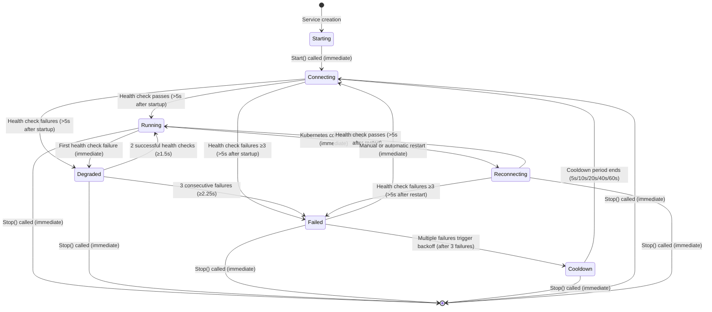

# kportforward Service State Diagram

This document illustrates the possible state transitions for services in kportforward. The diagram shows how services move between different states based on events like startup, health checks, context changes, and failures.

## State Diagram

## State Descriptions

| State | Description | Visual Indicator | Timing Information |
|-------|-------------|------------------|-------------------|
| **Starting** | Initial state when service is created | Orange dot | Very brief, transitions immediately to Connecting |
| **Connecting** | Service is starting the port-forward | Blue dot | Lasts at least 5s (grace period), then health checks begin |
| **Running** | Service is healthy and operational | Green dot | Remains until health check fails or context changes |
| **Degraded** | Service has health check issues but not enough to fail | Orange dot | Requires 3 consecutive failures (≥2.25s) to transition to Failed |
| **Reconnecting** | Service is restarting due to context change | Blue dot | Similar to Connecting, with 5s grace period |
| **Failed** | Service has failed health checks or other issues | Red dot | Immediate transition to Cooldown after 3 restart attempts |
| **Cooldown** | Service is waiting before retry due to backoff | Gray dot | Lasts for the duration of the backoff period (5s to 60s) |

## Transition Timing Details

### Health Check Timing
- **Grace period**: 5 seconds after service startup before health checks begin
- **Health check interval**: Based on monitoring interval (default: variable, typically ~750ms)
- **Connection test**: Each health check includes up to 3 retry attempts with 750ms delay (≤4.25s total)
- **Connection timeout**: 2 seconds per attempt

### State Transition Timings
- **Connecting → Running/Degraded/Failed**: Minimum 5s (grace period)
- **Running → Degraded**: Immediate on first health check failure
- **Degraded → Running**: Requires 2 successful health checks (≥1.5s)
- **Degraded → Failed**: Requires 3 consecutive failures (≥2.25s)
- **Failed → Cooldown**: After 3 restart attempts
- **Cooldown durations**: Exponential backoff: 5s, 10s, 20s, 40s, 60s max

### Context Change Timing
- **Any State → Reconnecting**: Immediate when context change detected
- **Reconnecting → Any State**: At least 5s (grace period) + health check time

### Failure and Recovery Thresholds
- **Failures to enter Degraded**: 1 (immediate)
- **Failures to enter Failed**: 3 consecutive (≥2.25s)
- **Successes to recover from Degraded**: 2 consecutive (≥1.5s)
- **Successes to recover from Failed**: 3 consecutive (≥2.25s)

## Health Check Logic

- Health checks begin after a grace period (5 seconds after startup)
- Each health check includes:
  - Process running check (immediate)
  - Port connectivity check (up to 3 retries with 750ms delay, 2s timeout per attempt)
- First health check failure moves Running → Degraded
- 3 consecutive failures move Degraded → Failed
- 2 consecutive successes move Degraded → Running
- 3 consecutive successes move Failed → Running
- Failed services enter cooldown after multiple restart attempts
- Cooldown duration follows exponential backoff: 5s, 10s, 20s, 40s, 60s max

## Context Change Handling

When Kubernetes context changes:
1. All services immediately transition to Reconnecting state
2. Services are restarted in the new context (with 100ms delay between services)
3. 5s grace period applies after restart
4. Health checks determine the next state (Running, Degraded, or Failed)